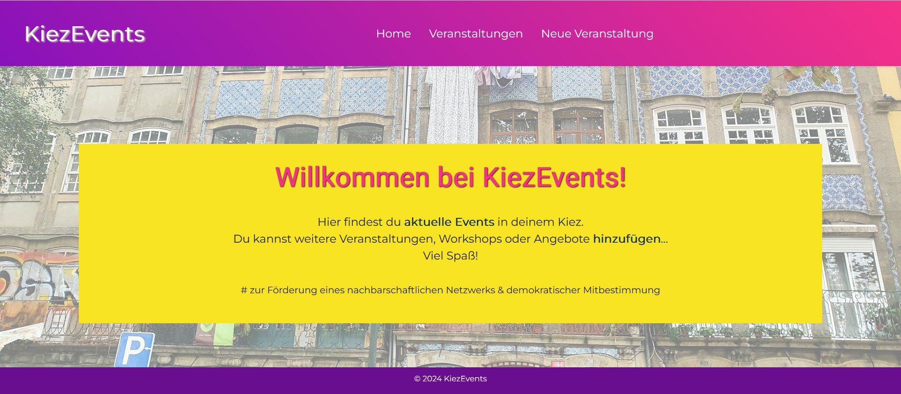
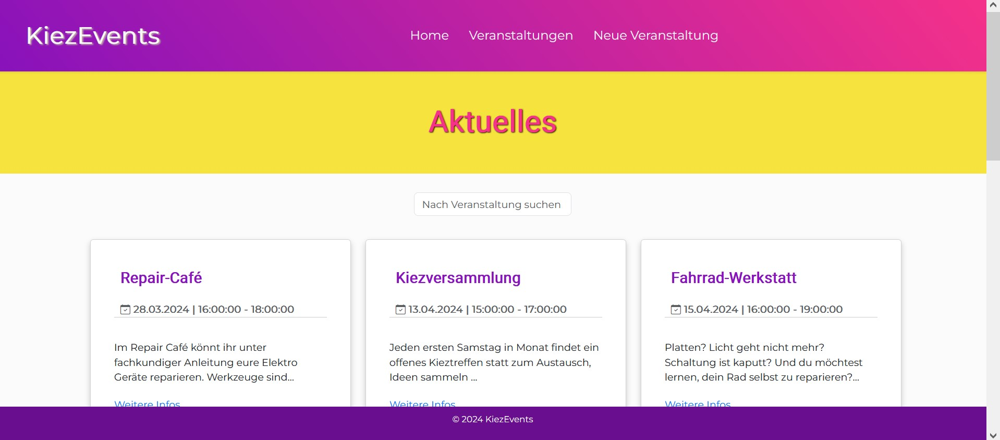
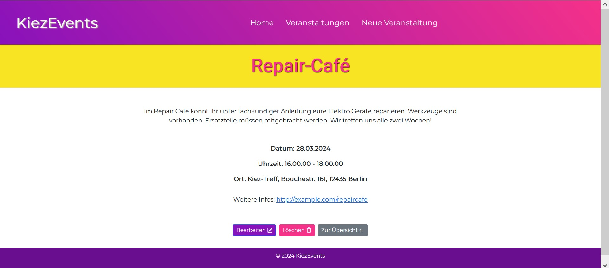
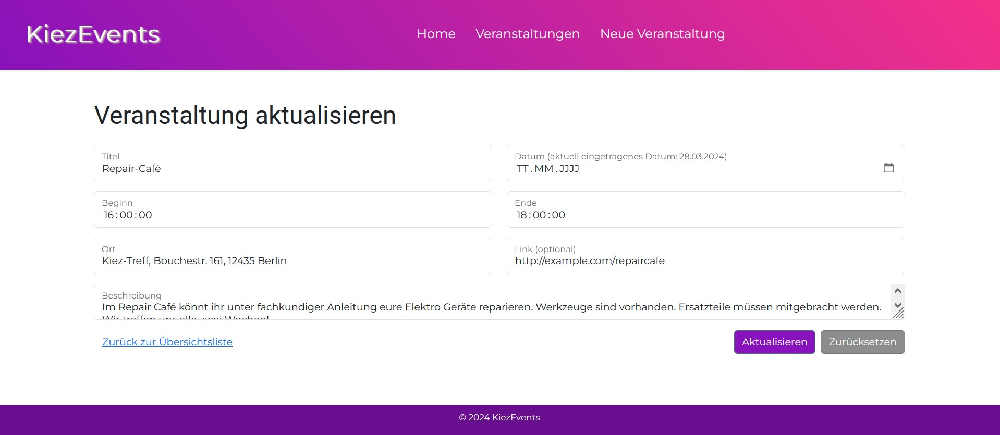
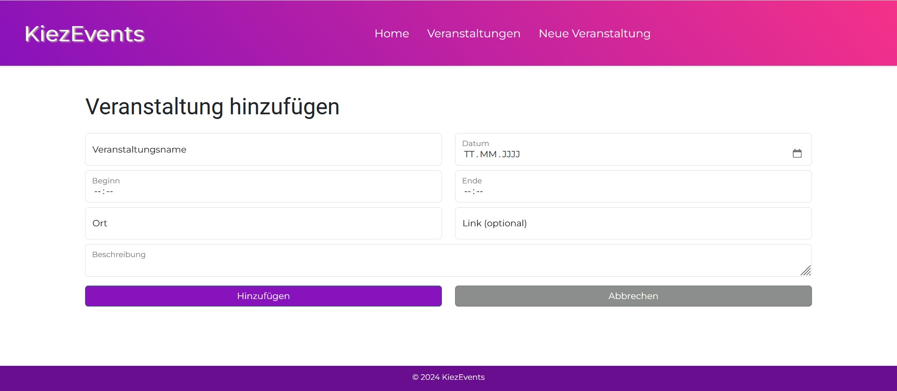

# Kiezevent Frontend

Diese Anwendung verwaltet Veranstaltungen im Kiez. Es können alle eingetragenen Events aufgelistet, einzelne Veranstaltungen aktualisiert, gelöscht und hinzugefügt werden.

## Installation für Entwicklung

Um das Frontend lokal auszuführen, stellen Sie sicher, dass Node.js auf Ihrem System installiert ist. Führen Sie dann die folgenden Schritte aus:

1. Das Repository auf Ihren lokalen Rechner klonen: `git clone https://github.com/s-matthies/kiezevent-frontend.git`
2. In das Verzeichnis des geklonten Repositories navigieren: `cd kiezevent-frontend`
5. `npm install` ausführen, um alle Abhängigkeiten zu installieren.
6. `ng serve` ausführen, um die Anwendung lokal zu starten.
7. Den Browser öffnen und zu `http://localhost:4200/` navigieren, um die Anwendung anzuzeigen.

## Zugriff auf das Deployed Frontend

Das bereitgestellte Frontend ist unter der folgenden URL verfügbar: https://kiezevents.vercel.app/

**Hinweis:** Bitte beachten Sie, dass das Backend für diese Anwendung auf einer kostenlosen Instanz bereitgestellt wird, die aufgrund von Inaktivität heruntergefahren werden kann. Dies kann zu Verzögerungen von 50 Sekunden oder mehr bei Anfragen führen.

## Verwendung

Die Anwendung ermöglicht es, auf die folgenden Funktionen zuzugreifen:

- **Startseite**

---

 - **Alle Veranstaltungen anzeigen (Filtern nach Veranstaltungsname möglich)** 

---

- **Nach der Auswahl einer Veranstaltung, wird eine detaillierte Ansicht mit zusätzlichen Informationen gezeigt**

---

- **Veranstaltung aktualisieren** 

---
  
- **Veranstaltung hinzufügen**

  

---
  
- **Veranstaltung löschen** 

## Technologien

- Angular: Diese Anwendung wurde mit [Angular CLI](https://github.com/angular/angular-cli) Version 17.0.3 erstellt.
- Bootstrap: Nutzung von Bootsrap für das UI-Design. | Version v5.3.2

## Backend

Das Frontend ist mit einem Backend-Server verbunden, der die Daten für die Veranstaltungen bereitstellt. Weitere Informationen zur Einrichtung und Verwendung des Backend-Servers finden Sie in der [Backend-README](https://github.com/s-matthies/Kiezevent-Backend.git).

